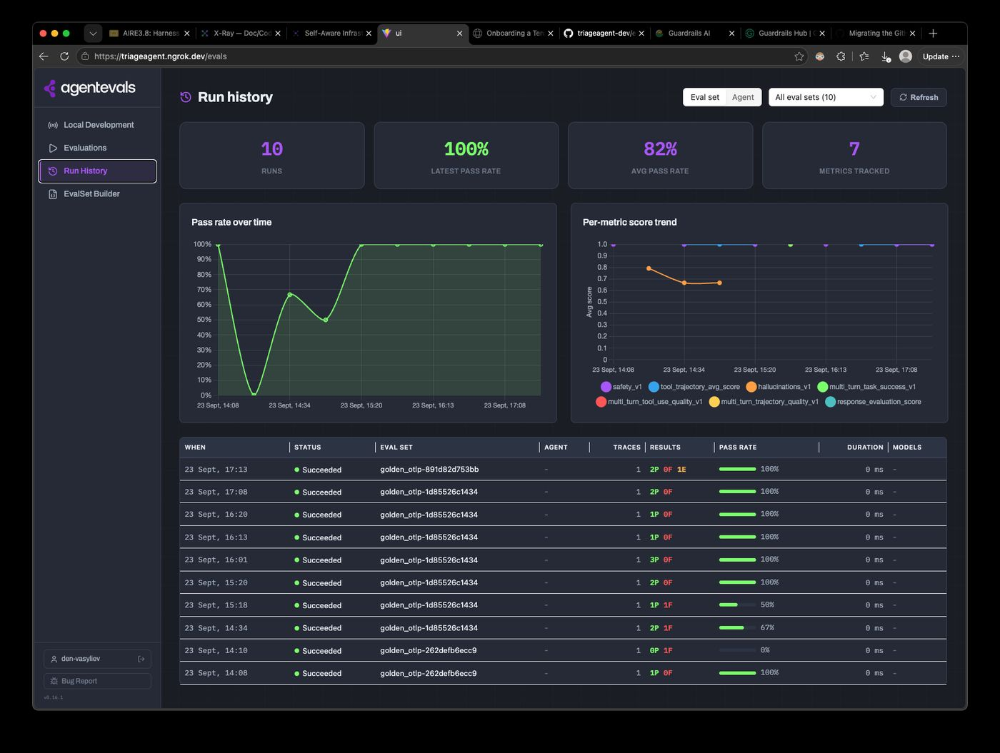

# agentevals-go

> **🚧 Work in progress.** This is a **Go fork/port of the original Python
> [`agentevals`](https://github.com/agentevals-dev/agentevals)** project - a from-scratch rewrite, not a
> vendored copy: score AI agent behavior from OpenTelemetry traces, no re-execution, no Python, no `litellm`.
> The API surface, auth model, and a couple of metrics are still incomplete and interfaces may change between
> releases - see [docs/STATUS.md](docs/STATUS.md) for exactly what's ported, what's a known simplification,
> and what's intentionally out of scope before relying on this or sending a PR.



The React UI is copied unmodified from the Python project's `ui/` (Vite + Ant Design); it already talks to its
backend over plain HTTP/WebSocket on `localhost:8001`, so it needs no changes to work against this server as
matching endpoints land.

**By the numbers** (see [docs/STATUS.md](docs/STATUS.md) for the detail behind each):

| | |
|---|---|
| Metrics ported | **10 / 12** (83%) - the 2 remaining are deliberately out of scope, not just unfinished |
| Go source | ~10,000 lines across 46 files |
| Go tests | ~4,400 lines, 131 test functions across 27 files |
| UI (TypeScript/TSX, unmodified from Python's `ui/`) | ~16,900 lines across 73 files |
| Container image | **18 MB** compressed (`cgr.dev/chainguard/static`, single static binary) vs. the Python image's **~193 MB** - ~11x smaller |

## Quick start

```bash
go build -o bin/agentevals ./cmd/agentevals

./bin/agentevals run samples/helm.json --eval-set samples/eval_set_helm.json -m tool_trajectory_avg_score
```

```
Trace: 3e289017fe03ffd7c4145316d2eb3d0d
[PASS]  tool_trajectory_avg_score      score=1.00 status=PASSED
```

This reproduces agentevals' own README quickstart example byte-for-byte (same sample trace, same eval set, same
score). Swap in `samples/k8s.json` and it reproduces the documented mismatch (score 0, FAILED) too.

```bash
make serve   # builds the UI, serves it + REST API on :8001, OTLP/HTTP receiver on :4318, OTLP/gRPC receiver on :4317
```

Point any OTel-instrumented agent at the receiver and it shows up live: `GET /api/streaming/sessions` for a
snapshot, `GET /ws/ui-updates` (WebSocket) for the live feed the UI actually connects to (`GET
/stream/ui-updates`, Server-Sent Events, still exists as a fallback/for `curl`, but some gateways buffer or
never forward long-lived SSE responses, so the UI's `LiveStreamingView.tsx` uses WebSocket instead - see
docs/STATUS.md).

```bash
export OTEL_EXPORTER_OTLP_ENDPOINT=http://localhost:4318   # OTLP/HTTP exporters (gRPC exporters use :4317)
python your_agent.py

curl http://localhost:8001/api/streaming/sessions
curl -N http://localhost:8001/stream/ui-updates   # SSE - simplest way to tail the feed from a shell
```

`final_response_match_v2`, `hallucinations_v1`, and `rubric_based_*_v1` need a judge model to call: a Gemini
API key (`GEMINI_API_KEY`/`GOOGLE_API_KEY`, or `--judge-api-key`), or Vertex AI via Application Default
Credentials (`GOOGLE_GENAI_USE_VERTEXAI=true` + `GOOGLE_CLOUD_PROJECT`/`GOOGLE_CLOUD_LOCATION`, no key at all -
see [deploy/k8s.yaml.example](deploy/k8s.yaml.example) for a working Deployment):

```bash
export GEMINI_API_KEY=...
./bin/agentevals run samples/helm.json --eval-set samples/eval_set_helm.json -m final_response_match_v2
./bin/agentevals run samples/helm.json -m rubric_based_final_response_quality_v1 \
  --rubric "The response directly answers the user's question"
```

`safety_v1` and the three `multi_turn_*_v1` metrics always call Vertex AI's Managed Eval Service directly via
Application Default Credentials, never an API key:

```bash
export GOOGLE_CLOUD_PROJECT=my-project GOOGLE_CLOUD_LOCATION=us-central1
./bin/agentevals run samples/helm.json -m safety_v1 -m multi_turn_task_success_v1
```

Sessions, Run History, and saved EvalSets survive a restart if you point `serve` at a SQLite file:

```bash
./bin/agentevals serve --session-db ./sessions.db   # or AGENTEVALS_SESSION_DB_PATH
```

`agentevals mcp` starts a [Model Context Protocol](https://modelcontextprotocol.io/) server on stdio (for
Claude Code, Cursor, GitHub Copilot CLI, etc.) exposing six tools:

| Tool | Needs `serve` running? | Description |
|---|---|---|
| `list_metrics` | yes | List available metrics and their requirements. |
| `evaluate_traces` | no (reads local files) | Evaluate local trace file(s) against selected metrics. |
| `list_sessions` | yes | List recent streaming sessions, most recent first. |
| `summarize_session` | yes | Show a session's invocations, tool calls, and messages. |
| `list_runs` | yes (+ `--session-db`) | List past evaluation runs (run history), most recent first. |
| `get_run_results` | yes (+ `--session-db`) | Get one run's full summary and per-eval-case result rows. |

`list_runs`/`get_run_results` are additive over Python (which has no run-history persistence to expose) and
require the server to have run history storage enabled (`serve --session-db`/`AGENTEVALS_SESSION_DB_PATH`).

Point it at a running `serve`; if that server has GitHub OAuth enabled, it authenticates non-interactively
with, in order: an explicit `--session-token`/`AGENTEVALS_SESSION_TOKEN`, or - simplest, no token to mint or
store at all - `gh auth token`'s output, as long as you're already logged in as a member of the deployment's
GitHub org:

```bash
AGENTEVALS_SERVER_URL=https://your-app.example.com ./bin/agentevals mcp   # uses `gh auth token` automatically
```

To mint a long-lived token instead (for a client with no `gh` available, e.g. a CI job):

```bash
./bin/agentevals auth mint-token --name my-mcp-client --secret "$AGENTEVALS_SESSION_SECRET"

AGENTEVALS_SERVER_URL=https://your-app.example.com \
AGENTEVALS_SESSION_TOKEN=<token from above> \
  ./bin/agentevals mcp
```

## Docs

- [docs/STATUS.md](docs/STATUS.md) - what's ported and working, the one known fidelity gap, everything
  intentionally not yet ported (and why), and a full file-by-file module inventory against the upstream
  Python project.
- [CONTRIBUTING.md](CONTRIBUTING.md) - ground rules, dev setup, pre-PR checklist.

## Layout

```
cmd/agentevals/     CLI entrypoint (run, serve, auth mint-token, mcp)
internal/trace/      normalized Span/Trace model + Jaeger JSON loader
internal/adk/         ADK Invocation/EvalSet data model, attribute extraction, ADK trace converter
internal/eval/         local built-in metrics (trajectory, ROUGE-1), eval set loading, metric dispatch
internal/judge/          LLM-as-judge metrics via google.golang.org/genai (final_response_match_v2)
internal/otlp/             AnyValue decoding, protobuf<->JSON bridge, OTLP export -> Span/Trace conversion, JSONL span parse/encode
internal/loader/              trace format auto-detection (Jaeger vs OTLP JSON/JSONL), used by POST /api/evaluate
internal/incremental/        real-time span/log -> conversation-element update extraction, for SSE push
internal/api/                   REST/UI server, OTLP/HTTP receiver, sessions (in-memory + optional SQLite archive), SSE hub
ui/                                React UI, copied unmodified from agentevals/ui
samples/                            helm.json / k8s.json / eval_set_helm.json, copied from agentevals/samples
deploy/                              deploy/k8s.yaml.example: sanitized manifest template (copy to
                                     deploy/k8s.yaml, gitignored, and fill in your own project/registry/hostname)
docs/                                 STATUS.md (full porting detail), images/ (README screenshots)
```

## Contributing

See [CONTRIBUTING.md](CONTRIBUTING.md) - ground rules (fidelity to the Python source, no Python/`litellm`
dependency, test what you change), dev setup, and a pre-PR checklist.

## License

[Apache License 2.0](LICENSE), matching the upstream Python `agentevals` project.
